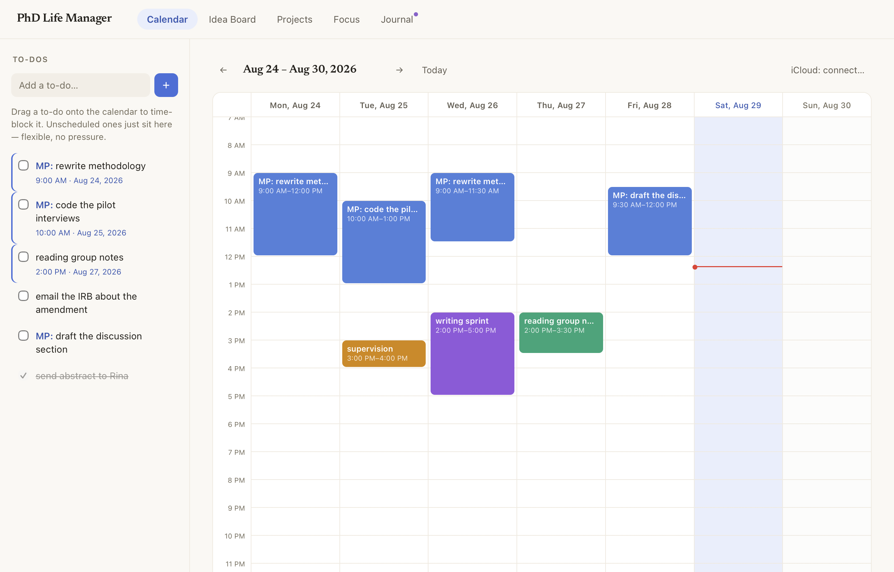

# PhD Life Manager

A local, single-user app for managing PhD work: calendar time-blocking synced
with Apple Calendar, to-dos, research ideas, projects with memos, a phone-free
focus timer, and a weekly recap.

Everything runs on your own machine. No cloud service, no accounts, no
framework, no build step. The backend is one Python file using only the
standard library; the interface is one HTML file, one CSS file and one JS file,
served straight off disk.



## What it does

- **Calendar** — drag to-dos onto a week grid to block time for them. Blocks
  sync both ways with a calendar in iCloud, so what you plan here shows up on
  your phone, and what you change on your phone shows up here.
- **Idea board** — somewhere to put research ideas before they are projects.
  Tags, starring, linking between ideas, and a "move to project" when one grows
  up.
- **Projects** — each with its own to-dos and plain-text memos.
- **Focus** — a timer for phone-free work, linked to the to-do or block you are
  working on, with a weekly breakdown of where the hours actually went.
- **Journal** — a weekly recap: what moved, what didn't, three self-rated dials,
  and a compare view across weeks.

## Requirements

- macOS 12 or later
- Python 3.9 or later (the one macOS ships with is fine)
- Xcode Command Line Tools, for `swiftc` — `xcode-select --install`

## Setting it up

```bash
git clone <your-fork-url> "PhD Life Manager"
cd "PhD Life Manager"
python3 -m venv .venv
.venv/bin/pip install -r requirements.txt
./mac/build.sh
```

`build.sh` compiles the app shell, generates the icon, and installs to
`~/Applications/PhD Life Manager.app`. Put it somewhere else with
`INSTALL_DIR=/Applications ./mac/build.sh`.

The app records the checkout it was built from, so it knows where to find the
Python half of itself. **If you move the project folder, run `build.sh` again.**

### Or run it without the app

```bash
.venv/bin/python3 server.py     # then open http://127.0.0.1:8765
```

The dependencies are only needed for iCloud sync. Without them the app still
runs — the calendar simply stays local to your machine.

## Connecting iCloud (optional)

1. In Apple Calendar, make a calendar named **Todos**. This is the one the app
   writes its own blocks to; everything else in your iCloud account is shown
   but never modified unless you edit it here deliberately.
2. Generate an app-specific password at
   [appleid.apple.com](https://appleid.apple.com) → Sign-In and Security →
   App-Specific Passwords. Your normal Apple ID password will not work.
3. Click **iCloud: connect…** in the app and enter your Apple ID and that
   password.

The password is stored in `data/caldav_config.json` on your machine, in plain
text, and goes nowhere else. `data/` is gitignored — do not commit it.

## Where your data lives

Everything is under `data/`, in formats meant to be readable without this app:

| Path | What |
|---|---|
| `todos.json`, `calendar.json`, `focus_sessions.json` | structured records |
| `ideas.txt` | every idea, one delimited text file |
| `projects/<slug>/project.json` + `memos/<id>.txt` | one memo per file |
| `journal/weekly/<monday>.txt`, `journal/daily/<date>.txt` | plain text |
| `caldav_config.json` | your Apple ID and app-specific password |
| `caldav_cache.json` | last-known iCloud snapshot; safe to delete |

To back it up, copy `data/`. To move machines, copy `data/` across.

## Developing

The interface is served live from disk — edit `public/*` and press ⌘R in the
app. Changes to `server.py` need the app restarted. Only `mac/main.swift` and
`mac/makeicon.swift` need `./mac/build.sh`.

`CLAUDE.md` documents the parts that are not obvious from reading the code —
particularly the iCloud sync, which has several hard-won details that look like
they could be simplified and cannot.

## A note on signing

`build.sh` signs the app ad-hoc (`codesign --sign -`). That is enough for an app
you compiled yourself on your own machine. It is *not* enough to hand someone a
prebuilt `.app` — macOS Gatekeeper will refuse to open it, and getting past that
properly needs a paid Apple Developer account and notarisation. Building from
source, as above, avoids the problem entirely.

## Status

This is a personal tool, built for one person's working habits, shared in case
it is useful. It has no tests, no migrations, and no upgrade path — if you
change the data formats, you are on your own. Fork it and make it yours.
